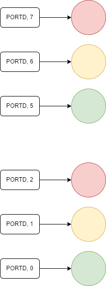
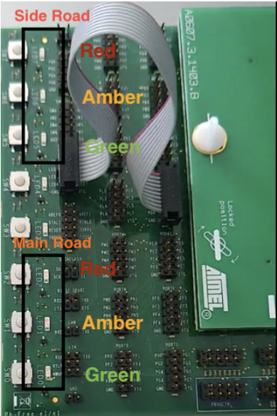
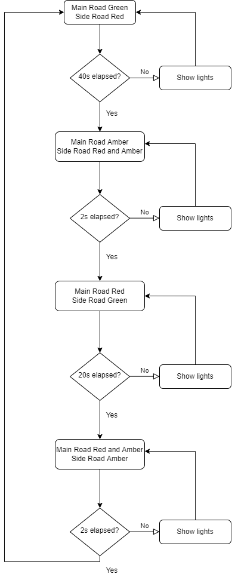

# traffic-light-system-avr
A Traffic Light System written in Assembly for AVR Microcontroller 32 bit.

# Design and Development

## 1.0 Requirements:

To develop a traffic light system in AVR, the in-built LEDs will be used to act as 2 sets of traffic lights. The bottom three LEDs will represent the traffic lights of the main road and the top three LEDs will represent the side road’s lights.

To generate the necessary time delay for the traffic lights, we will use Timer1 of the AVR due to the necessity of generating 2, 20 and 40 seconds delays. This can only be achieved using the prescaling of clk/1024 as calculated below:

For XTAL = 1 MHz, 1 Machine cycle = 1 / 1 MHz = 1 μs.
Hence, with the prescaler clk/1024, 1 Machine cycle will become: 1024 μs.

For Timer1, we have the ability to run 65536 machine cycles, so to generate specific time delay, the following should be used: 
02 seconds delay: 1953 cycles 
20 seconds delay: 19531 cycles 
40 seconds delay: 39062 cycles 

Hence, the following values for TCNT1 will be used: 
02 seconds delay: 65536 - 01953 = 63583 = 0xF85F 
20 seconds delay: 65536 - 19531 = 46005 = 0xB3B5 
40 seconds delay: 65536 - 39062 = 26474 = 0x676A 

Since TCNT1 is a 16 bit register, these values will be split into high and low bytes and stored in TCNT1H and TCNT1L respectively. 
These calculations form the basis of the flowchart in the following section.

## 2.0 Flowchart

## 3.0 Testing

Burning the main.asm program in the AVR microcontroller using Microchip Studio will run the traffic light system as demonstrated in the attached video: https://drive.google.com/file/d/1xCDSHLJ5hmQZoEMYHPMPTW3-BsNZp7wX/view
